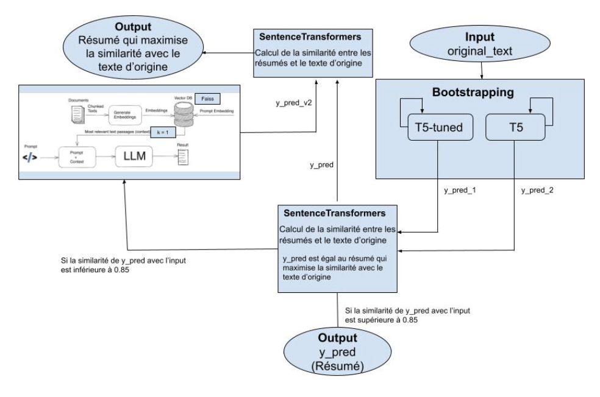

# Legal Text Summarizer

Our **Legal Text Summarizer** project, developed during the **Airbus Hackathon**, is a practical application of existing advancements in text summarization to address the challenges posed by extensive legal documents.

The model is a combination of classical transformers for text summarization and RAG (Retrieval Augmented Generation). The classical transformers are the main components of the model as the RAG is quite energy hungry and we wanted to make an efficient model regarding energy consumption. 

**We achieved 3rd place.**

## Overview
- [How to use](#howtouse)
- [Examples](#examples)
- [Model](#model)
- [Results](#results)
- [Authors](#auteurs)
- [Licence](#licence)

## How to use

In order to use the text summarizer you must provide a config file in the yaml format :

```yaml
parameters_textsum_archi:
  n_brut_force: 5

models:
  number: 2
  models_names: ["google-t5/t5-base", "facebook/bart-base"]
  models_params: [
    ["./weight/google-t5/tokenizer", "./weight/google-t5/t5-base"],
    ["./weight/facebook/tokenizer", "./weight/facebook/bart-base"]
  ]

modelsRAG: 
  chunk_size: 1000
  chunk_overlap: 100
  api_key: "11111111111111111111111111111111111111"
  repo_id: "mistralai/Mistral-7B-Instruct-v0.2"


dbRAG: 
  datapath: "./data.json"
```

There are two ways to use the text summarizer: 
 - if you want to use the model to evaluate it on the dataset you should have a dataset to test it on : 
```python
python main.py --config_file_path config.yaml --data_test_path data.json --evaluation_mode
```
 - if you want to use the model just to summarize one text, you can use the following command and put the text in the input window 
```python
python main.py --config_file_path config.yaml 
```

## Examples

1. Evaluation 

2. One shot summary 

## Model

The model is composed of two part: 
 - in the first part we use **classical transformers** trained on text summarization task like **T5 and BART** in order to produce summaries using **bootstrapping strategies** in order to choose the summary from the model that has the highest similarity with the original text. Then, we use an **ensemble strategy** to choose the summary with again the highest similarity between the outputs of T5 and BART
 - the second part of the model is used only if the summary produced by T5 or BART does not have a **similarity higher than 0.85**. It's a **RAG** where the vector database is a database composed of the data provided in the config file. The **vector database is built using FAISS**. Then the prompt is enriched and passed through the LLM that has been chosen in the config file.



## Authors 

- [Alexandre Abela](https://github.com/alexandreabela)
- [Vincent Lébé](https://github.com/vlebe)
- [Théo Saulais](https://github.com/tsaulais)
- [Joey Skaf](https://github.com/jskaf34)

## Licence

This project is under the licence [MIT](https://opensource.org/license/mit).
